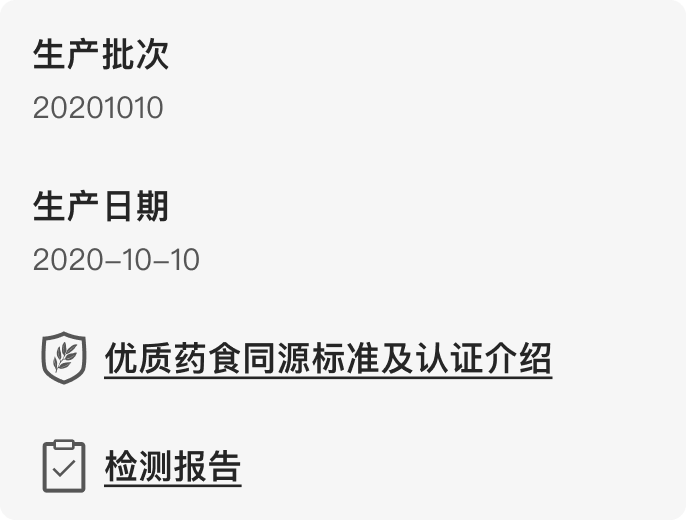

# 扩展信息

**扩展信息**：在防伪码扫码展示的页面中，商家借助扩展信息可以把更多信息展示消费者。比如，商家的线上商城链接、公司官网链接、商品溯源信息页面链接等等。

可以为不同商品、同一商品的不同防伪码号段设定不同的扩展信息，并且不限制设定扩展信息的数量。每一条扩展信息包括如下内容：

1. **图标**：选填项，建议尺寸 48\*48px，请保证多条扩展信息的图标风格一致
2. **标题**：必填项，信息的名称 
3. **内容**：选填项，该条信息的详细内容
4. **链接**：选填项，点击该信息可跳转到一个新的页面，链接支持两种类型：
   1. 网页地址：跳转到指定的网页地址。适合商家的商城链接、公司官网等，链接页面建议适配移动端设计，方便手机用户阅读
   2. 详情页：系统根据提供的一组图片生成详情页，适合商品的检测报告等

> 注：关于设置扩展信息的具体细节可以联系本公司的商务人员

